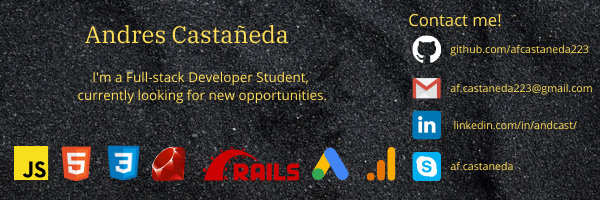

### <h2>Hi, im Andres Castañeda</h2></h2>
<p><em>Remote Full-stack web developer ready for adventure</em>


```javascript
const andresCastaneda = {
  lookingFor: "Front-end developer" || "Full-stack web developer",
  code: [JavaScript, React, Redux, Ruby on Rails, HTML/CSS, Semantic UI, Bootstrap, 
  Tailwind CSS],
  funFacts: ['I have 2+ years of remote work experience with devs from all over the world']
}
```
<<<<<<< HEAD
[](https://github.com/afcastaneda/github-readme-stats)
=======
>>>>>>> e5c71f246cf36364c5ef4520fe4e3a28c7014c43
